# Azure Pipeline Deployment Instructions

1. Clone this repo
2. Create new repo on your GitHub account and push the contents up to it
3. [Create a free Azure DevOps account](https://azure.microsoft.com/en-us/pricing/details/devops/azure-devops-services/) (Click **Start Free** under **Azure Pipelines**) if you haven't already
4. Create a new Project

   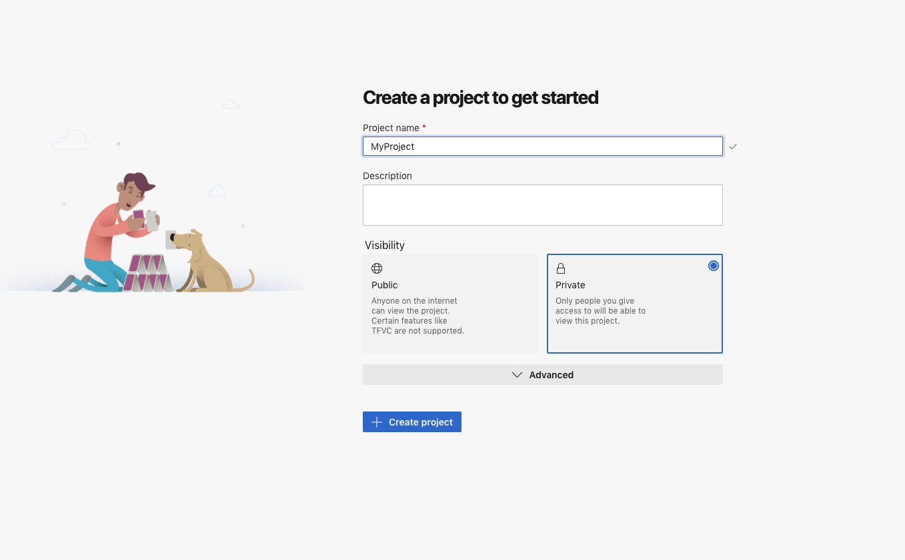

5. Once the project is created, you're taken to the New Pipeline page. Select **GitHub**

   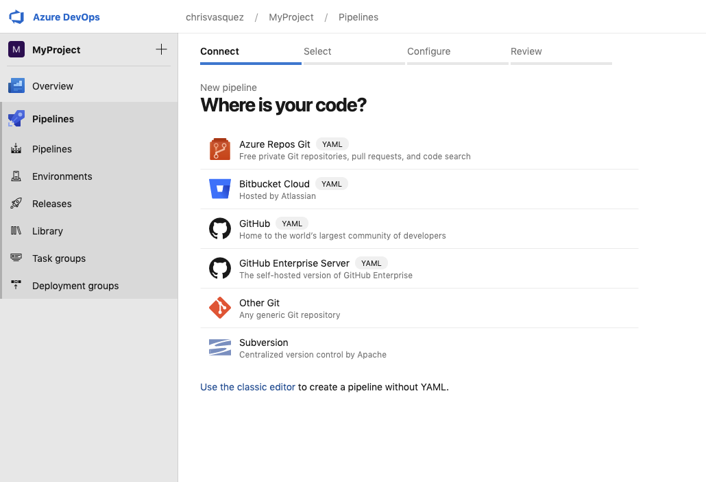

6. Select your GitHub repo
7. Configure your pipeline by choosing **Existing Azure Pipelines YAML File** and select the `azure-piplines.yaml` file in the menu that pops out on the right.

   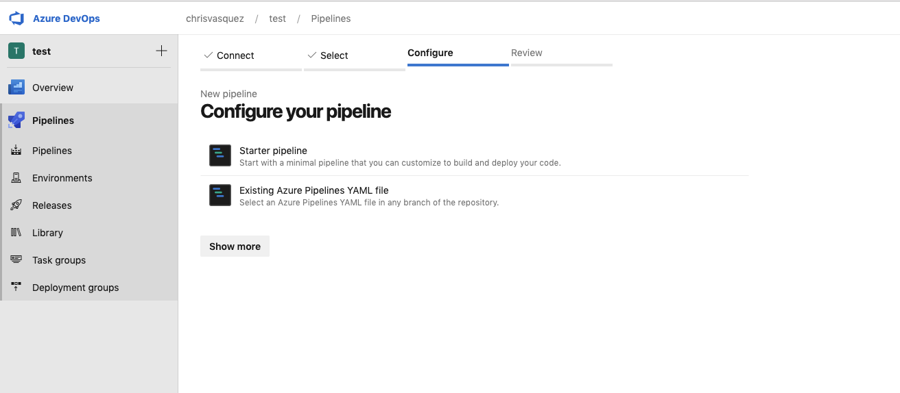

8. On the **Review** page, use the drop down arrow next to **Run** and select **Save**. Don't run the pipeline just yet. This will create an environment for the next step.

   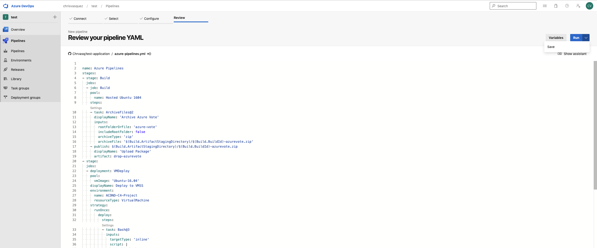

9. Click on **Environments** and you should see an environment named **ACDND-C4-Project**. Click on it.

   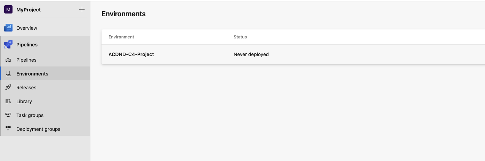

10. Once inside the environment, click on **Add resource**.

      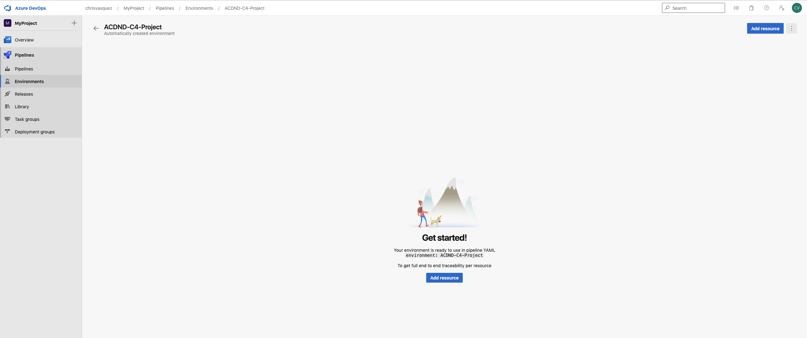

11. Select **Virtual Machine**.

      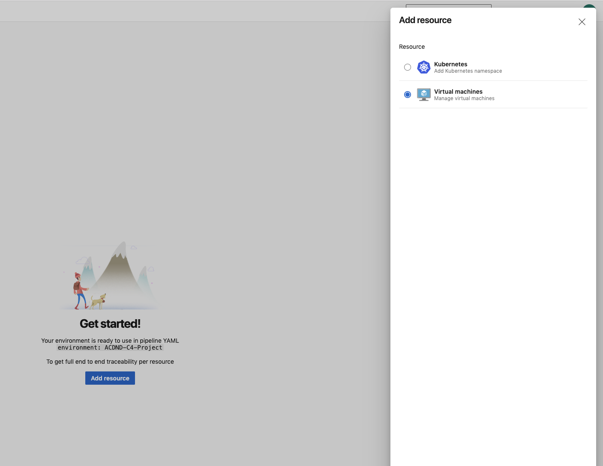

12. Select **Linux** as the OS. You'll then need to copy the registration script to your clipboard and run this on the VM terminal.

      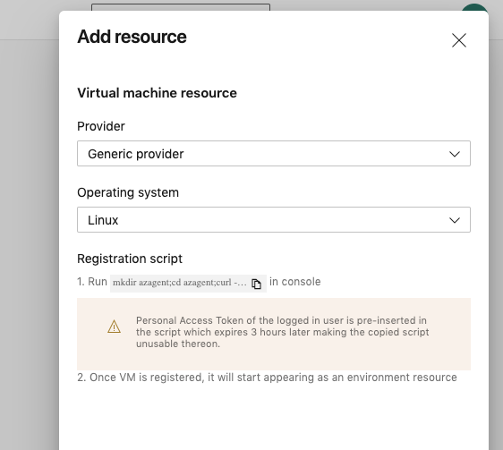

13. You should see a similar output from the script in the screenshot below. You can skip entering environment VM resource tags by inputting **N**.

      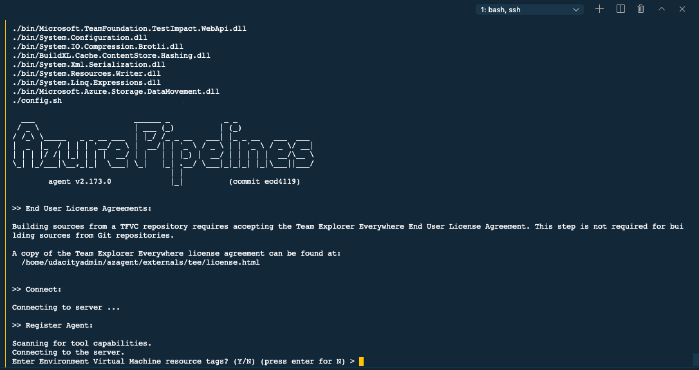

14. If everything was successful, you should see this output from the connection test. **Note**: Be sure to `cd ~` or disconnect from the VM once the registration script completes. If you are still in the `azagent` directory during deployment, you'll most likely run into an issue.

      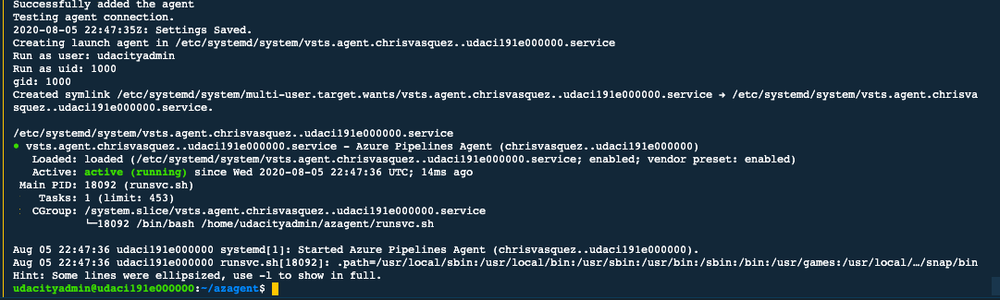

**NOTE**: If the registration script shows `sudo: ./svc.sh: command not found`, run the following command in your VM terminal and then try the registration script again.

```bash
sudo bin/installdependencies.sh
cd ..
sudo rm -rf azagent
```

15. Back on Azure DevOps portal in Environments, you can close out the **Add resource** menu and refresh the page. You should now see the newly added VM resource listed under **Resources**.

      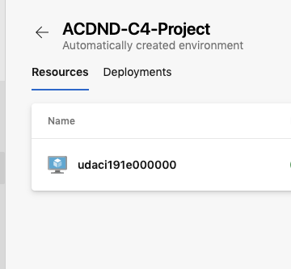

16. We're ready to deploy our application! Navigate to **Pipelines** and click **Run pipeline**.

      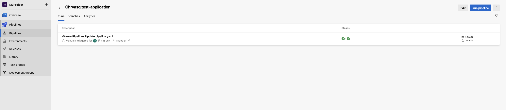

This will go through the process of downloading the application files and zip them up as an artifact to be uploaded to the VM. Then it will run through the bash script in the `pipelines.yaml` file, installing all dependencies and moving the artifact .zip file to an `app` directory where it will unzip the contents. If you get all green checks, you're ready to head back to the VM.

17. This should be the final step. Connect to the VM if you arent' aready. `cd` into the app directory and run `python3 main.py`.

If you visit the public IP address for the VMSS in your browser, you should see your deployed application.

Head back to the main [README](README.md#project-instructions) for further instructions.
